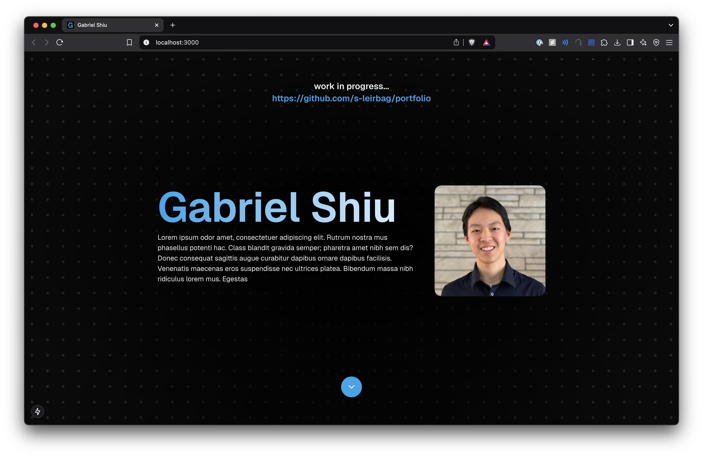

# Portfolio Site

### https://www.gabrielshiu.com/

[](https://www.gabrielshiu.com/)

## 🚀 Features
- Responsive design for all devices 📱💻
- Dynamic project showcase 🎨
- Internal content model 🧩
- More to come 🔜

## 🛠️ Tech Stack
- React
- Next.js
- TypeScript
- Tailwind CSS
- Vercel

## ⚙️ Setup & Installation
1. Clone this repository:
   ```bash
   git clone https://github.com/s-leirbag/portfolio.git
   ```
2. Navigate to the project folder:
   ```bash
   cd portfolio
   ```
3. Install dependencies:
   ```bash
   pnpm install
   ```
4. Start the development server:
   ```bash
   pnpm dev
   ```

## Todo
- Fix dots on mobile
- Add other projects
- Add animations
- Email form
- Remove redundant CSS
